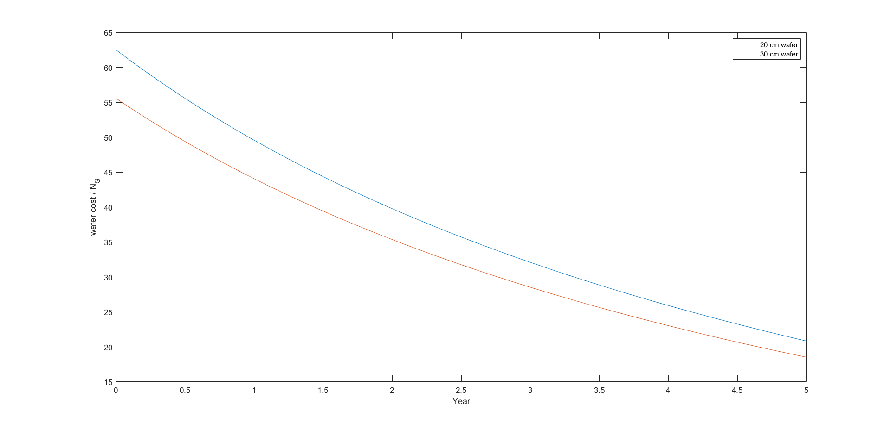

# ECE4810J Homework 3

Yihua Liu 518021910998

Interfaces:

Q1: A debug interface is an interface that allows for quick and efficient debug, determination of root cause, and fix implementation in the design.

Differences between passive vs. active debug:

Passive debug is to let device send out debug messages over a debug interface, and the debugger host captures and displays the messages that can possibly be any text or data that helps in identifying the state, control, or data flow of the device being debugged, while active debug is to let device involve in inquiring, and/or changing the state, control, or data flow of the device. Passive debug is that debugger host receives debugging messages from the debugged but not asking for data through a debug interface mono-directionally, while active debug is that two debugged device communicating through a debug interface bidirectionally, which means one debugger can ask for additional data and state information and change the control flow or data. The debugger sends a command to the debugged and waiting for the responds of the debugged device. Passive debugging is simpler.

Q2. UART has less overhead than USB and less expense than USB in terms of cost and power (less power consumption). It is better suited when Bluetooth is integrated as part of platform than USB.

Timing:

Q3. 

1) The optimum number of pipeline segments:
$$
T=\sum_i{P_\text{max\,i}}=0.6+0.8+0.3+0.7+0.9+0.5=3.8\,\text{ns}\\
C=0.1\,\text{ns}\\
b=0.25\\
S_\text{opt}=\sqrt{\frac{(1-b)T}{bC}}=\sqrt{\frac{0.75\times3.8}{0.25\times0.1}}=\sqrt{114}\approx11
$$
2) Cycle time:

$$
\Delta t=\frac{T}{S}+C=\frac{3.8}{11}+0.1=\frac{49}{110}\approx0.445\,\text{ns}
$$

3) The pipeline performance with this cycle time:

$$
G\Delta t=\frac{1}{1+(S-1)b}=\frac{1}{1+10\times0.25}=\frac{2}{7}\approx0.286
$$

Q4.

1) The fastest possible clock that allows worst-case circuits to work correctly without setup violations:

Preventing setup violations:
$$
\begin{aligned}
t_\text{clock}&\geq t_\text{clock-Q-max}+t_\text{logic-max}+t_\text{set-up}+t_\text{skew}\\
&=950+(210+200+180)+300+750\\
&=2590\,\text{ps}
\end{aligned}
$$

2) 

Preventing hold violations:
$$
\begin{aligned}
t_\text{skew}+t_\text{hold}&<t_\text{c-q}+t_\text{cd}\\
750+400&<300+\text{min}((70+50+40),170)\\
1150&<460
\end{aligned}
$$
Thus, there is potential for a hold violation.

Area:

Q5. 30 cm wafer production process should be chosen. Assume production of good devices is constant in each year.

The number of dice on the 20 cm wafer:
$$
N_1=\frac{\pi d^2}{4A}=\frac{400\pi}{4\times1.4^2}\approx160
$$
The number of dice on the 30 cm wafer:
$$
N_2=\frac{\pi d^2}{4A}=\frac{900\pi}{4\times1.4^2}\approx360
$$
The cost of 20 cm wafer production:
$$
c_1(t)=-400t+5000
$$
The cost of 30 cm wafer production:
$$
c_2(t)=-800t+10000
$$
The be number of good dice on the 20 cm wafer:
$$
N_{G1}(t)=(1-(-0.08t+0.5))N_1=(0.08t+0.5)N_1=12.8t+80
$$
The be number of good dice on the 30 cm wafer:
$$
N_{G2}(t)=(1-(-0.08t+0.5))N_1=(0.08t+0.5)N_1=28.8t+180
$$
The wafer cost / $N_G$ for 20 cm wafer:
$$
\frac{c_1(t)}{N_{G1}}=\frac{-400t+5000}{12.8t+80}
$$
The wafer cost / $N_G$ for 30 cm wafer:
$$
\frac{c_2(t)}{N_{G2}}=\frac{-800t+10000}{28.8t+180}
$$
 

Given cost / die = wafer cost / $N_G$, 20 cm wafer has a higher cost per die than 30 cm wafer, so 30 cm wafer production process should be chosen.

Q6.

1) The total area of this FPGA in $\text{mm}^2$ is

$$
33792\times(1200+700)\times675\times14^2\approx8.5\times10^{12}\,\text{nm}^2=8.5\,\text{mm}^2
$$

2) The area of the ASIC approach is $<64\times3840f^2=245760f^2$ (64 AND gates and 49 adders). The area of the reconfigurable approach is $700\times675f^2=472500f^2$. Thus, the ASIC approach is more efficient in terms of area.

Q7.

1) The remaining area is

$$
5200-(100+96+200+256+96+200+352+650+512)=2738\,A
$$

This cache will be
$$
2738\times1481=4054978\,\text{bit}=506872.25\,\text{byte}
$$

2) 

Pros: Increasing area allows more area for memory storage and cache storage, which will allow better  chip performance; increasing area also more functional units, which will allow more functions of the chip.

Cons: Increasing area will increase the complexity of the design, so that more hardware design efforts need to be put; increasing area also increases the time-to-market, which may do damage to the market competitiveness; increasing area also increases the effort to write documentation for the product and service the system.
