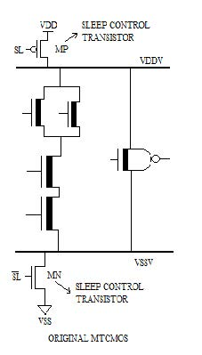

# HW4

Yihua Liu 刘翊华 518021910998

## Power

Q1: Calculate energy dissipated in circuit during 2ms period if

1) Its switching probability is 0.3, operating frequency 500MHz, load capacitance 10fF and supply voltage 1.2V
   $$
   C_L=10^{-14}\,\text{F}\\
   V_{DD}=1.2\,\text{V}\\
   \alpha=0.3\\
   f=5\times10^8\,\text{Hz}\\
   t=2\times10^{-3}\,\text{s}\\
   P_{dyn}=C_LV_{DD}^2\alpha f=2.16\times10^{-6}\,\text{W}\\
   E=Pt=4.32\times10^{-9}\,\text{J}
   $$
   
2) Its switching probability is 0.5, operating frequency 250MHz, load capacitance 12fF and supply voltage 1.0V
   $$
   C_L=1.2\times10^{-14}\,\text{F}\\
   V_{DD}=1.0\,\text{V}\\
   \alpha=0.5\\
   f=2.5\times10^8\,\text{Hz}\\
   t=2\times10^{-3}\,\text{s}\\
   P_{dyn}=C_LV_{DD}^2\alpha f=1.5\times10^{-6}\,\text{W}\\
   E=Pt=3\times10^{-9}\,\text{J}
   $$
   

Q2: Calculate energy dissipated in circuit during 2ms period:

1. Take data from Q1 and assume that circuit powered down during 0.5ms (dynamic energy=0)
   $$
   E=Pt=2.16\times10^{-6}\,\text{W}\times1.5\times10^{-3}\,\text{s}=3.24\times10^{-9}\,\text{J}
   $$

2. Take data from Q1 and assume that circuit powered down during 1.2ms (dynamic energy=0)
   $$
   E=Pt=2.16\times10^{-6}\,\text{W}\times0.8\times10^{-3}\,\text{s}=1.728\times10^{-9}\,\text{J}
   $$

Q3: Show which circuit has lower switching activity (ignore glitching effects).
$$
P_{X0->1}=(1-P_AP_B)P_AP_B=(1-0.25)\times0.25=\frac{3}{16}\\
P_X=P_AP_B=\frac{1}{4}\\
P_{W0->1}=(1-P_XP_C)P_XP_C=(1-\frac{1}{8})\times\frac{1}{8}=\frac{7}{64}\\
P_W=P_XP_C=\frac{1}{16}\\
P_{F0->1}=(1-P_WP_D)P_WP_D=(1-\frac{1}{16})\times\frac{1}{16}=\frac{15}{256}
$$

$$
P_{Y0->1}=(1-P_AP_B)P_AP_B=(1-0.25)\times0.25=\frac{3}{16}\\
P_Y=P_AP_B=\frac{1}{4}\\
P_{Z0->1}=(1-P_CP_D)P_CP_D=(1-0.25)\times0.25=\frac{3}{16}\\
P_Z=P_CP_D=\frac{1}{4}\\
P_{F0->1}=(1-P_YP_Z)P_YP_Z=(1-\frac{1}{16})\times\frac{1}{16}=\frac{15}{256}
$$

Therefore, the first (the left one, chain) circuit has lower switching activity (ignore glitching effects).

Q4: Show how input reordering can decrease switching activity.
$$
P_{X0->1}=(1-P_AP_B)P_AP_B=(1-0.1)\times0.1=0.09\\
P_X=P_AP_B=0.1\\
P_{F0->1}=(1-P_XP_C)P_XP_C=(1-0.01)\times0.01=0.0099
$$
After input reordering:
$$
P_{X0->1}=(1-P_BP_C)P_BP_C=(1-0.02)\times0.02=0.196\\
P_X=P_AP_B=0.02\\
P_{F0->1}=(1-P_XP_A)P_XP_A=(1-0.01)\times0.01=0.0099
$$
Thus, input reordering can decrease switching activity.

Q5: Explain how MTCMOS (Multi Threshold CMOS) circuits work, and how they decrease leakage current.

MTCMOS (Multi Threshold CMOS) circuits have two modes: active mode and standby mode. In active mode (low threshold mode), SL is set low, the two sleep control (high) transistors MP and MN are "on", whilst VDDV and VSSV almost function as VDD and VSS [^1].  In standby mode (high threshold mode), SL is set high, the two sleep control (high) transistors MP and MN are "off" and the leakage is suppressed.

They can decrease leakage current because standby mode has high $\mathrm{V_{th}}$, and high $\mathrm{V_{th}}$ can reduce static leakage power [^2]. They are used on non-critical paths.

## Interconnects

Q6: For the following RC-chain calculate Elmore delay from node “source” to node “output”.
$$
\begin{aligned}
\tau_{Dout}&=\sum_{i=1}^N(ir\Delta L)c\Delta L=rc(\Delta L)^2(1+2+\dots+N)\\
&=rc(\frac{1}{N})^2\frac{1+N}{2}N=rcl^2\frac{1+N}{2N}\\
\end{aligned}
$$

$$
N=4\\
\tau_{Dout}=\frac{5rcl^2}{8}=\frac{5RC}{8}
$$

## Reliability

Q7: Calculate the parity of a byte with the value $17_\text{ten}$ and show the pattern stored to memory. Assume the parity bit is on the right. Suppose the second most significant bit was inverted in memory, and then you read it back. Did you detect the error? What happens if the two most significant bits are inverted?

00010001

2 1s, parity is even, parity bit is 0.

00010001|0

The second most significant bit was inverted: 01010001|0

3 1s, parity is odd. We detected the error.

If the two most significant bits are inverted: 11010001|0

4 1s, parity is even. We did not detect the error.

Q8: Assume one byte data value is $11010010_\text{two}$. First show the Hamming ECC code for that byte, and then invert $9^\text{th}$ bit and show that the ECC code finds and corrects the single bit error.

__1_101_0010

0_1_101_0010

011_101_0010

0110101_0010

Final code: 011010110010

Inverting bit 9: 011010111010

Parity bit 1 is 0 (5 1s, so odd parity; there is an error somewhere).

Parity bit 2 is 1 (4 1s, so even parity; this group is OK).

Parity bit 4 is 0 (2 1s, so even parity, this group is OK).

Parity bit 8 is 1 (3 1s, so odd parity; there is an error somewhere).

Observation: bit 1 & 8 (1001) are incorrect ->  $9^\text{th}$ bit must be wrong.

Correction: inverting bit 9, done!

## Reference

[^1]: Abhijit Asthana and Akashe Shyam. "Power Efficient D Flip Flop Circuit Using MTCMOS Technique in Deep Submicron Technology." *International Journal of Engineering Research & Technology (IJERT)* Vol. 2 Issue 11, November - 2013. [Power Efficient D Flip Flop Circuit Using MTCMOS Technique in Deep Submicron Technology (ijert.org)](https://www.ijert.org/research/power-efficient-d-flip-flop-circuit-using-mtcmos-technique-in-deep-submicron-technology-IJERTV2IS110637.pdf).
[^2]: Anis, M.; Areibi; Mahmoud; Elmasry (2002). "Dynamic and leakage power reduction in MTCMOS circuits". *Design Automation Conference, 2002*. Proceedings. **39th**: 480–485. ISBN 1-58113-461-4.
